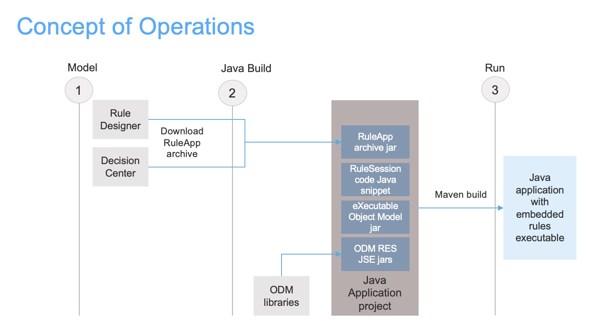
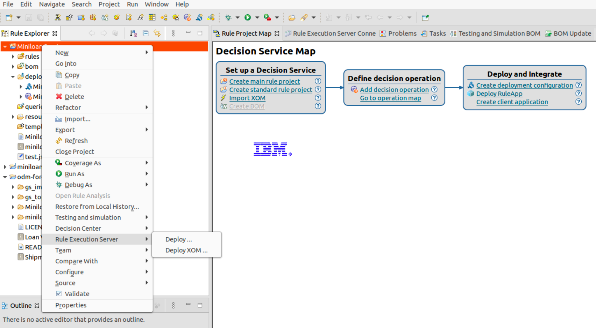
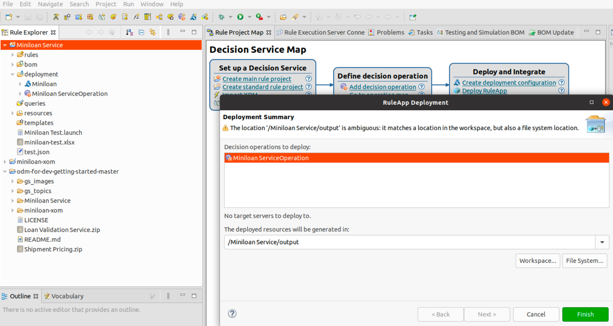
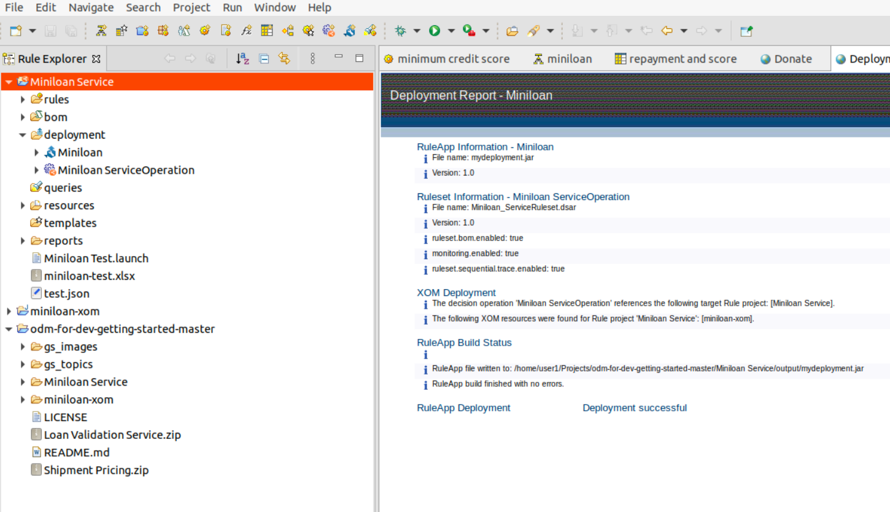

# How to promote a ruleapp archive for embedded execution with ODM

## Step 1 - Generate a ruleapp archive from your decision service project
### Step 1.1 - From ODM Rule Designer
In your decision service project generate the ruleapp archive.

Select your decision service project in the explorer. Right click and select the Rule execution Server > Deploy... item.

Now select the decision service operation for which you want to generate the executable RuleApp archive, and where you choose to write it.

Congratulations. Your RuleApp archive has been written. In this example under mydeployment.jar name that can be changed.

### Step 1.2 - From ODM Decision Center
Alternatively you can generate the ruleapp archive for your decision service project in Decision Center.

At the end of this step you have obtained a ruleapp archive downloaded on your file system

## Step 2 - Create a Java application to execute the decision service

### Step 2.1 - Package the ODM execution jars
Add theses librairies to load and execute a decision service compiled as a ruleapp archive.

### Step 2.2 - Write a decision service runner
The code snipplet has a generic base. It just varie s depending on the signature of the decision service, the level of trace that your request, and potentially the configuration of the embedded Rule Execution Server rulesession factory.

### Step 2.3 - Package the ruleapp archive in the Java application jar
Add the ruleapp archive jar to the Java application classpath.

### Step 2.4 - Compile
javac commonly through a maven command

### Step 2.5 - Run
Launch our Java application. It executes the business rules as modeled in Rul Designer and Decision Center compiled and fully packaged within your application. No need of the RES DB, HTDS or other ODM parts. You are now ready to execute at scale and maximum speed your business rules in Java. Et voila. 
